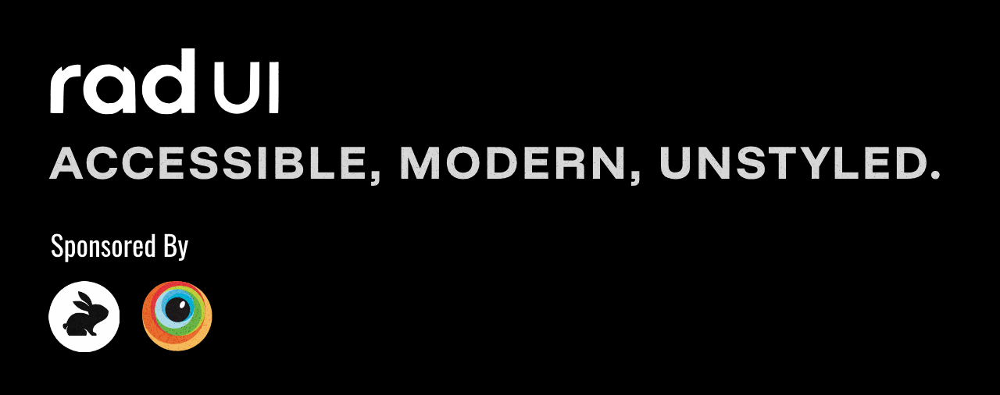

[](https://codecov.io/gh/rad-ui/ui)

# Rad UI



## What is Rad UI?

Rad UI is a single, cohesive React component system for teams that want full control over their UI.

It is built for long lived products, custom design systems, and engineers who are tired of fighting pre baked styles, fragile abstractions, and dependency soup.

Rad UI handles behavior, accessibility, and composition so you can own structure, visuals, and tokens without compromise.

If your UI is becoming infrastructure, Rad UI is built for you.

## Why Rad UI exists

Most UI libraries optimize for speed at the start and cost you later.

They ship opinions disguised as convenience.  
They lock you into styling decisions.  
They scale poorly once your product and team grow.

Rad UI takes a different approach.

- One codebase, not a bundle of libraries
- One accessibility model across all components
- Predictable behavior and upgrade paths
- Detach first architecture with clean escape hatches
- Designed to plug into your existing design system

We chose cohesion over assembly and ownership over shortcuts.

## What Rad UI is not

- Not a starter kit
- Not a theme library
- Not a copy paste UI generator
- Not optimized for screenshots or demos

Rad UI is intentionally boring in the ways that save you time and money later.

## Components and examples

Explore the full component set and live examples in Storybook:

https://main--657eda33d6033847be90aaf8.chromatic.com/

## Documentation

Complete guides, architecture notes, and contribution docs live here:

https://www.rad-ui.com/docs/first-steps/introduction

Docs are treated as product, not an afterthought.

## Installation

Install Rad UI from npm:

```bash
npm install @radui/ui
```

Rad UI works with modern React setups and is friendly to tokens, CSS variables, and custom theming strategies.

## Philosophy

Rad UI is opinionated where bugs live and flexible where taste lives.

We are strict about:
- Accessibility
- Keyboard and focus behavior
- Composition patterns
- Predictable APIs

We are deliberately neutral about:
- Styling
- Theming
- Design tokens
- Visual language

Bring your own system. Rad UI adapts.

## Getting involved

Rad UI is open source and built in the open.

If you care about UI architecture, accessibility, and long term maintainability, we would love your help.

Contribution guide:  
https://www.rad-ui.com/docs/contributing/before-you-start

Dev environment setup:  
https://www.rad-ui.com/docs/contributing/setting-up-dev-environment

## Community and support

GitHub Discussions:  
https://github.com/rad-ui/ui/discussions

Discord:  
https://discord.com/invite/nMaQfeEPNp

Questions, ideas, and strong opinions are welcome.

## License

Rad UI is open source software.  
See the LICENSE file for details.

## Development environment

Node versions tested:
- 18.19.0
- 19.x
- 20.x
- 21.4.0

## Credits

Rad UI stands on the shoulders of great work in the ecosystem.

Heavily inspired by Radix UI, Floating UI, shadcn/ui, and other libraries that shaped modern UI development.

We respect them.  
We made different tradeoffs.
